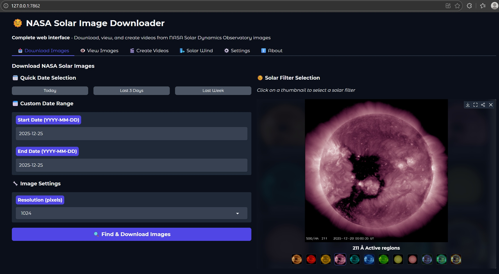
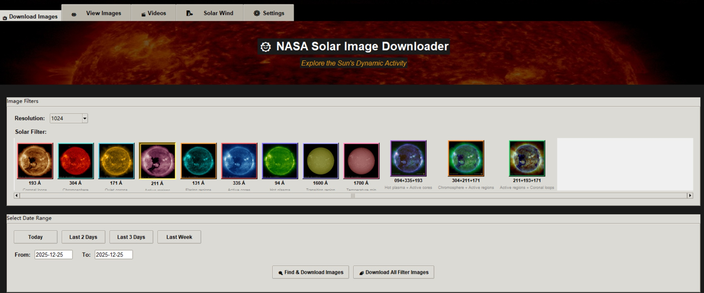

# 🌞 NASA Solar Image Downloader

A comprehensive Python application for downloading, viewing, and analyzing solar images from NASA's Solar Dynamics Observatory (SDO). Features multiple interfaces including web-based Gradio interfaces, video creation capabilities, and real-time solar wind data analysis.

Video tutorial, https://youtu.be/sMNstj4-Rl8?si=xW7LcV4NqDrc1BuT




## ✨ Features

### 🖥️ Multiple Interface Options
- **Web Interface (Gradio)**: Modern web-based interface with full functionality
- **GUI Interface**: Traditional desktop application with tkinter
- **Command Line**: Batch processing and automation scripts

### 📥 Image Management
- Download solar images from NASA SDO in multiple wavelengths (94Å, 131Å, 171Å, 193Å, 211Å, 304Å, 335Å, 1600Å, 1700Å)
- Support for composite filters (multi-wavelength combinations)
- Multiple resolution options (1024px, 2048px, 4096px)
- Automatic file organization by date and filter
- Corrupted file detection and cleanup

### 🎬 Video Creation
- Create time-lapse MP4 videos from image sequences
- FFmpeg and OpenCV support for video encoding
- Web-compatible video formats
- Customizable frame rates and quality settings

### 🌬️ Solar Wind Analysis
- Real-time solar wind data from NOAA Space Weather Prediction Center
- Interactive Plotly visualizations
- Multiple analysis types: time series, correlation, distribution, statistical
- Geomagnetic storm detection and alerts
- Temperature, density, speed, and magnetic field monitoring

### 🎮 Image Viewer
- Interactive image playback with navigation controls
- Variable speed playback (0.5 - 240 FPS)
- Date range filtering and selection
- Full-screen viewing capabilities

## 🚀 Quick Start

### Prerequisites

- Python 3.8 or higher
- pip (Python package installer)
- Optional: FFmpeg for enhanced video creation

### Installation

1. **Clone the repository:**
   ```bash
   git clone https://github.com/AK51/SolarImageDownloader.git
   cd SolarImageDownloader
   ```

2. **Create a virtual environment (recommended):**
   ```bash
   python -m venv .venv
   
   # On Windows:
   .venv\Scripts\activate
   
   # On macOS/Linux:
   source .venv/bin/activate
   ```

3. **Install dependencies:**
   ```bash
   # For full functionality (recommended):
   pip install -r requirements_gradio.txt
   
   # For minimal installation:
   pip install -r requirements_minimal.txt
   
   # For basic functionality:
   pip install -r requirements.txt
   ```

4. **Optional: Install FFmpeg for enhanced video creation:**
   - **Windows**: Download from [ffmpeg.org](https://ffmpeg.org/download.html) and add to PATH
   - **macOS**: `brew install ffmpeg`
   - **Ubuntu/Debian**: `sudo apt install ffmpeg`

## 🎯 Usage

### Python project

```bash
python launch_gui.py
```
- **Features**: Traditional desktop interface
- **Best for**: Users who prefer desktop applications

### Web Interface (Recommended)

#### Option 1: Main Web Application (`app.py`)
```bash
python app.py
```
- **URL**: http://127.0.0.1:7860
- **Features**: Complete web interface with all functionality
- **Best for**: General use, full feature access

#### Option 2: Alternative Web Interface (`gradio_app.py`)
```bash
python gradio_app.py
```
- **URL**: http://127.0.0.1:7862
- **Features**: Alternative implementation with same functionality
- **Best for**: Development, testing, or if main app has issues

## 📁 Project Structure

```
nasa-solar-downloader/
├── 📄 app.py                    # Main web application
├── 📄 gradio_app.py            # Alternative web interface
├── 📄 launch_web.py            # Web launcher with auto-setup
├── 📄 launch_gui.py            # GUI launcher
├── 📄 main.py                  # Core application entry point
├── 📁 src/                     # Source code modules
│   ├── 📁 downloader/          # Download functionality
│   ├── 📁 storage/             # File management
│   ├── 📁 scheduler/           # Task scheduling
│   └── 📁 ui/                  # User interface components
├── 📁 data/                    # Downloaded images (auto-created)
├── 📁 video/                   # Created videos (auto-created)
├── 📁 temp_videos/             # Temporary video files (auto-created)
├── 📁 tests/                   # Test files
├── 📄 requirements*.txt        # Dependency files
└── 📄 README.md               # This file
```

## 🌞 Solar Filter Guide

| Filter | Wavelength | Description | Best For |
|--------|------------|-------------|----------|
| 94Å | 94 Angstrom | Hot plasma | Flaring regions |
| 131Å | 131 Angstrom | Flaring regions | Solar flares |
| 171Å | 171 Angstrom | Quiet corona | Coronal loops |
| 193Å | 193 Angstrom | Coronal loops | Corona structure |
| 211Å | 211 Angstrom | Active regions | Solar activity |
| 304Å | 304 Angstrom | Chromosphere | Surface features |
| 335Å | 335 Angstrom | Active cores | Hot regions |
| 1600Å | 1600 Angstrom | Transition region | UV emissions |
| 1700Å | 1700 Angstrom | Temperature minimum | Surface detail |

### Composite Filters
- **094+335+193**: Multi-temperature view
- **304+211+171**: Full atmosphere view
- **211+193+171**: Active region focus

## 🌬️ Solar Wind Features

### Real-Time Data
- **Magnetic Field**: Bx, By, Bz components and total field strength
- **Plasma Parameters**: Solar wind speed and proton density
- **Temperature**: Calculated proton temperature
- **Geomagnetic Status**: Storm condition alerts

### Visualization Types
- **Time Series**: Historical data trends
- **Correlation**: Parameter relationships
- **Distribution**: Statistical distributions
- **Statistical**: Summary statistics and box plots

### Data Sources
- NOAA Space Weather Prediction Center
- Real-time solar wind magnetic field data
- Real-time solar wind plasma data

## 🎬 Video Creation

### Supported Formats
- **Output**: MP4 (H.264 encoded)
- **Quality**: Web-optimized with fast-start
- **Frame Rates**: 1-120 FPS
- **Resolutions**: 1024px, 2048px, 4096px

### Creation Methods
1. **FFmpeg** (preferred): High-quality, web-optimized
2. **OpenCV** (fallback): Compatible alternative

### Video Features
- Automatic filename generation with date ranges
- Progress tracking during creation
- Web-compatible encoding
- Automatic video player integration

## 🔧 Configuration

### Custom Keywords
Customize search keywords for each solar filter in the Settings tab:
- Modify filter search terms
- Reset to defaults
- Apply custom naming conventions

### Data Management
- **Cleanup**: Remove corrupted files automatically
- **Organization**: Automatic date-based folder structure
- **Storage**: Configurable data directory location

## 🐛 Troubleshooting

### Common Issues

#### Video Playback Problems
- **Solution**: Videos are automatically copied to `temp_videos/` for compatibility
- **Cleanup**: Old temporary files are automatically removed

#### Missing Dependencies
```bash
# Reinstall all dependencies
pip install -r requirements_gradio.txt --force-reinstall
```

#### FFmpeg Not Found
- Install FFmpeg and add to system PATH
- Application will fall back to OpenCV if FFmpeg unavailable

#### Connection Errors
- Check internet connection for NASA data downloads
- Verify NOAA endpoints are accessible for solar wind data

### Debug Mode
Enable debug output by checking console logs when running the application.

## 📊 Data Sources

- **NASA Solar Dynamics Observatory (SDO)**: Solar images
- **NOAA Space Weather Prediction Center**: Solar wind data
- **Helioviewer Project**: Image metadata and organization

## 🤝 Contributing

1. Fork the repository
2. Create a feature branch (`git checkout -b feature/amazing-feature`)
3. Commit your changes (`git commit -m 'Add amazing feature'`)
4. Push to the branch (`git push origin feature/amazing-feature`)
5. Open a Pull Request

## 📝 License

This project is licensed under the MIT License - see the [LICENSE](LICENSE) file for details.

## 🙏 Acknowledgments

- **NASA Solar Dynamics Observatory** for providing high-quality solar images
- **NOAA Space Weather Prediction Center** for real-time solar wind data
- **Helioviewer Project** for image organization and metadata
- **Gradio Team** for the excellent web interface framework
- **OpenCV and FFmpeg** communities for video processing capabilities

## 📞 Support

- **Issues**: [GitHub Issues](https://github.com/yourusername/nasa-solar-downloader/issues)
- **Discussions**: [GitHub Discussions](https://github.com/yourusername/nasa-solar-downloader/discussions)
- **Documentation**: Check the source code comments for detailed API documentation

---


**Created by Andy Kong** | **Powered by NASA SDO Data** | **Built with Python & Gradio**
